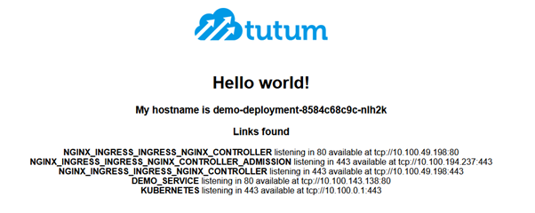
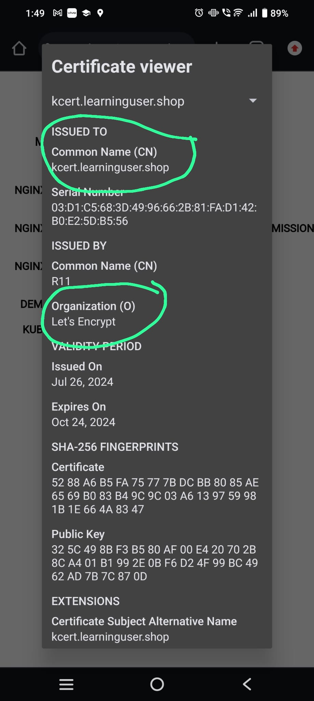

# Assumption

* You have a public DNS for your website
* You are using ingress controller like nginx
* You have kubectl access to the cluster  

## Installation

1. **Create k8s cluster using eksctl**
    * > eksctl create cluster -f eks.yaml
    * > eksctl delete cluster -f eks.yaml

2. **Ingress Controller setup (if not done already)**
    * > helm repo add ingress-nginx [https://kubernetes.github.io/ingress-nginx](https://kubernetes.github.io/ingress-nginx)
    * > helm repo update ingress-nginx
    * > helm install nginx-ingress ingress-nginx/ingress-nginx
    * > kubectl delete -A ValidatingWebhookConfiguration nginx-ingress-ingress-nginx-admission

3. **Update DNS**
    * > kubectl get svc

        ```text
        NAME                                               TYPE           CLUSTER-IP       EXTERNAL-IP                                                              PORT(S)                      AGE
        kubernetes                                         ClusterIP      10.100.0.1       <none>                                                                   443/TCP                      15m
        nginx-ingress-ingress-nginx-controller             LoadBalancer   10.100.39.202    a2a11ea50ada143ae9a5524d86e0c015-162498528.us-east-1.elb.amazonaws.com   80:30852/TCP,443:31669/TCP   91s
        nginx-ingress-ingress-nginx-controller-admission   ClusterIP      10.100.192.162   <none>                                                                   443/TCP                      91s
        ```

    * > Update dns for the hosts in your ingress

4. **Kcert Setup**
    * > kubectl create -f kcert/kcert.yml

5. **Kcert Check**
    * > kubectl get all -n kcert

        ```text
        NAME                        READY   STATUS    RESTARTS   AGE
        pod/kcert-df6b5fb7f-7srnc   1/1     Running   0          14s

        NAME            TYPE        CLUSTER-IP     EXTERNAL-IP   PORT(S)           AGE
        service/kcert   ClusterIP   10.100.3.221   <none>        80/TCP,8080/TCP   14s

        NAME                    READY   UP-TO-DATE   AVAILABLE   AGE
        deployment.apps/kcert   1/1     1            1           14s

        NAME                              DESIRED   CURRENT   READY   AGE
        replicaset.apps/kcert-df6b5fb7f   1         1         1       14s
        ```

6. **Create ingress**
    * > kubectl create -f app/app.yaml
    * > kubectl create -f app/kcert-demo.yaml
    * > kubectl get secrets -A

        ```text
        NAMESPACE   NAME                                    TYPE                 DATA   AGE
        default     kcert-learninguser-shop                 kubernetes.io/tls    2      38s
        default     nginx-ingress-ingress-nginx-admission   Opaque               3      11m
        default     sh.helm.release.v1.nginx-ingress.v1     helm.sh/release.v1   1      11m
        default     sh.helm.release.v1.nginx-ingress.v2     helm.sh/release.v1   1      10m
        ```

7. **Check Your app**
    * Open Your App in the browser [https://kcert.learninguser.shop](https://kcert.learninguser.shop)
    * 
    * Should show valid certificate 😀
    * Certificate issued by [https://letsencrypt.org/](https://letsencrypt.org/)
    * 